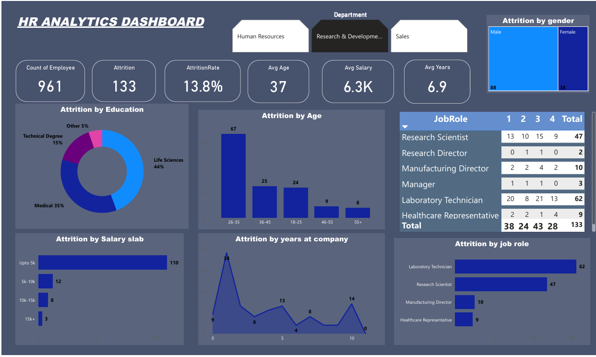

# HR Analytics Dashboard — Power BI

## 📊 Project Overview
This project is an interactive **HR Analytics Dashboard** built using **Power BI**. It analyzes employee attrition data to help HR teams understand why employees are leaving and identify patterns across different departments, age groups, salary slabs, and job roles.

---

## 🎯 Objective
To analyze employee attrition and provide actionable insights that help organizations **reduce turnover** and **improve employee retention**.

---

## 📌 KPIs Tracked
| KPI | Value |
|-----|-------|
| Total Employees | 961 |
| Total Attrition | 133 |
| Attrition Rate | 13.8% |
| Average Age | 37 |
| Average Salary | 6.3K |
| Average Years at Company | 6.9 |

---

## 📈 Visualizations Included
- **Attrition by Education** — Donut chart showing attrition across education fields
- **Attrition by Age** — Bar chart showing which age groups have highest attrition
- **Attrition by Salary Slab** — Bar chart comparing attrition across salary ranges
- **Attrition by Years at Company** — Line chart showing attrition trend over tenure
- **Attrition by Job Role** — Bar chart and Matrix table showing attrition per role
- **Attrition by Gender** — Treemap comparing male vs female attrition
- **Department Filter** — Slicer to filter all visuals by department

---

## 🔍 Key Insights & Conclusions
1. **Highest attrition is in the 26–35 age group** (67 employees) — young professionals are leaving the most
2. **Laboratory Technicians** have the highest attrition (62) among all job roles
3. **Employees earning up to 5K salary** have the most attrition (110) — low salary is a major factor
4. **Life Sciences (44%)** and **Medical (35%)** education fields contribute most to attrition
5. **Research & Development** department has significant attrition compared to others
6. Employees with **fewer years at the company** tend to leave more — retention is weakest in early years

---

## 🛠️ Tools Used
- **Power BI Desktop** — Dashboard creation and data visualization
- **Microsoft Excel / CSV** — Data source (HR Analytics dataset)
- **DAX** — For calculated measures and KPIs

---

## 📷 Dashboard Screenshot

---

## 📁 Files in This Repository
| File | Description |
|------|-------------|
| `HR analytics dashboard power BI.pbix` | Main Power BI Dashboard file |
| `HR_Analytics.csv` | Dataset used for analysis |
| `screenshot.png` | Dashboard preview image |

---

## 🚀 How to Open
1. Download the `.pbix` file
2. Open with **Power BI Desktop** (free download from Microsoft)
3. Explore the interactive dashboard!

---

## 👤 Author
**[MAITRY KAUSHIK]**
- LinkedIn: [Your LinkedIn Profile](https://www.linkedin.com/in/maitry-kaushik-21b955299)

---

*This project was built as part of my Data Analytics learning journey.*
